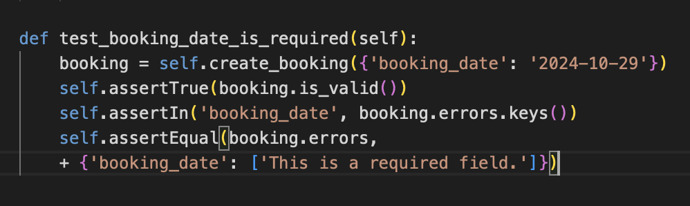
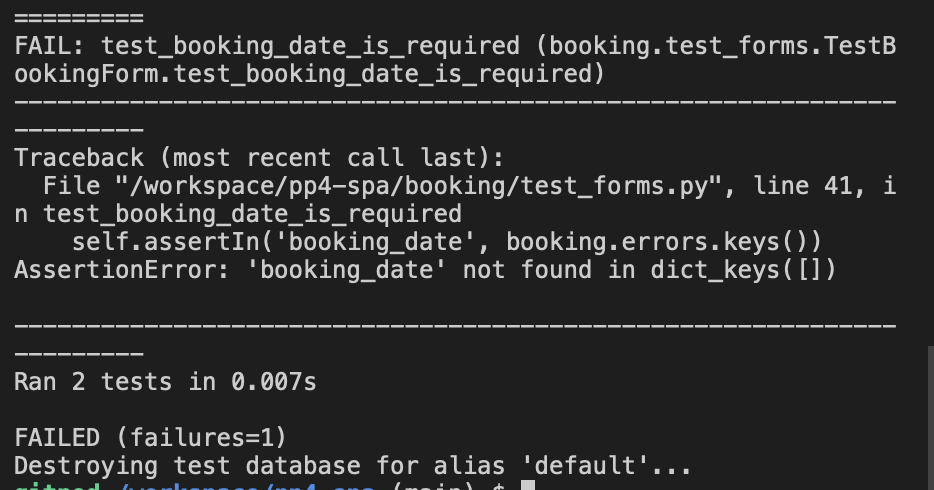
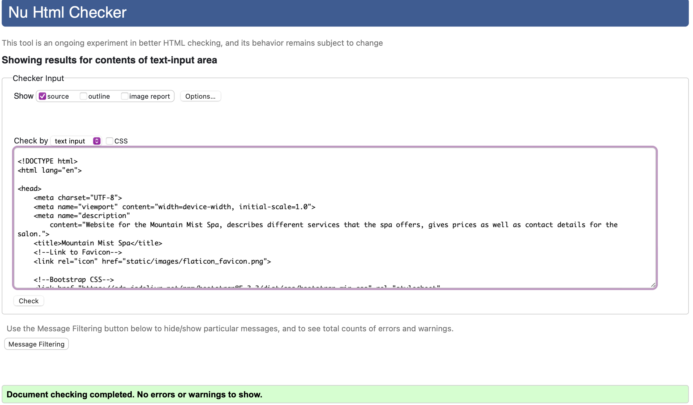
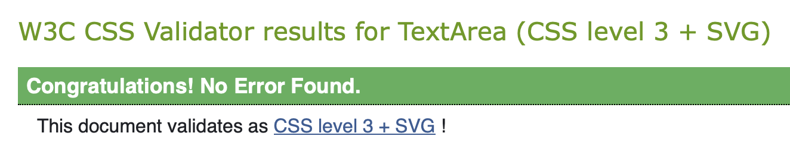
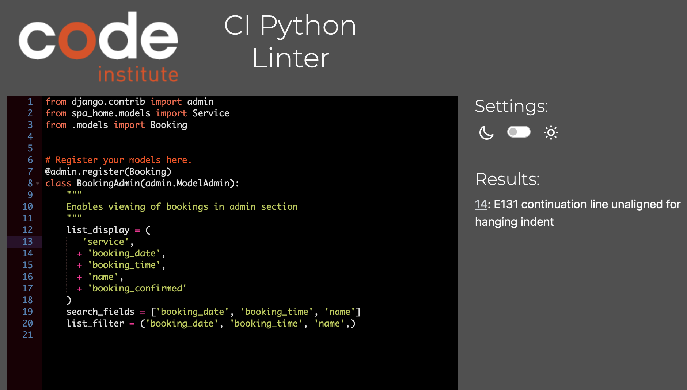
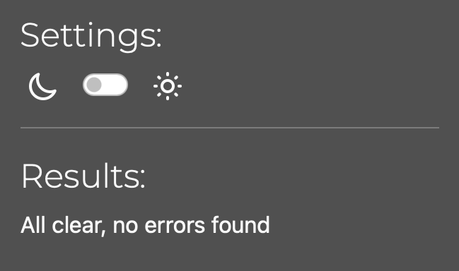
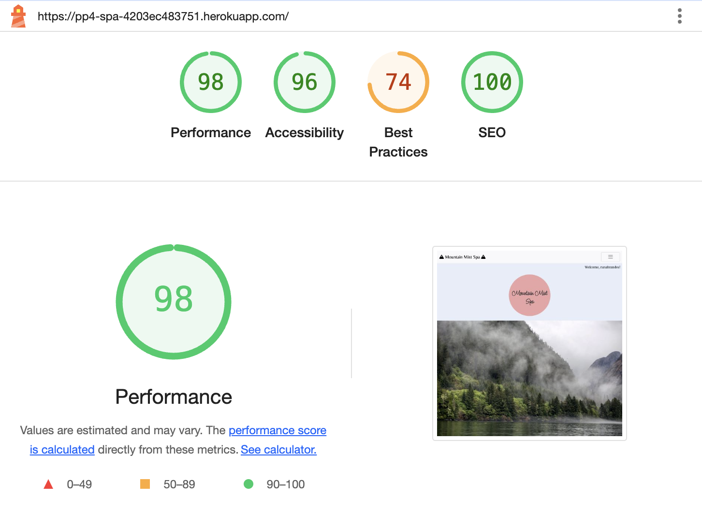
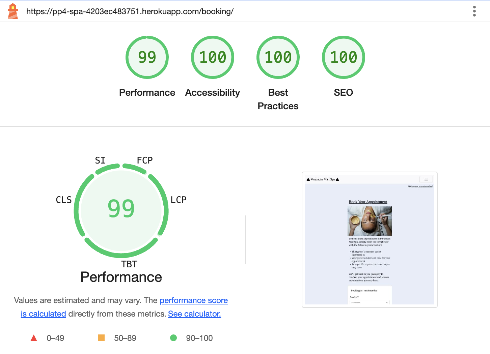
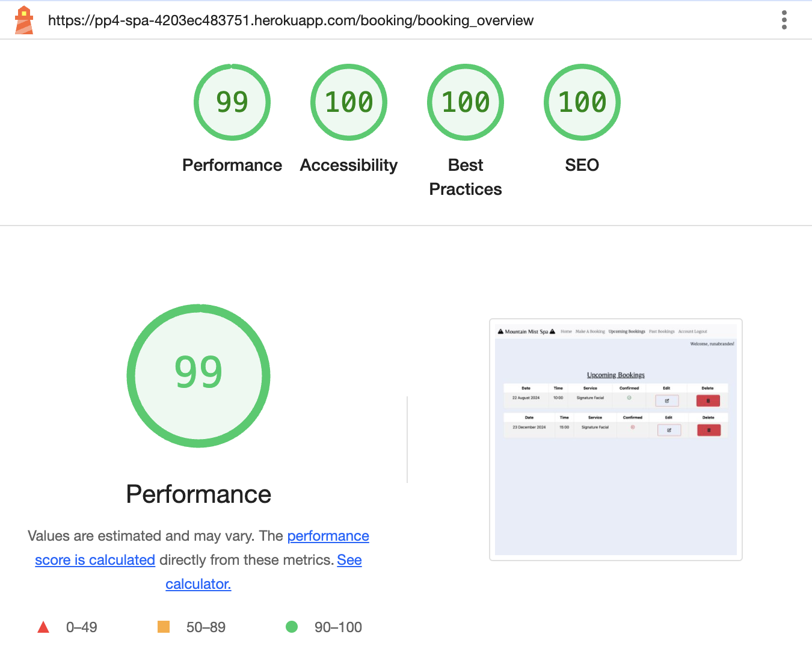
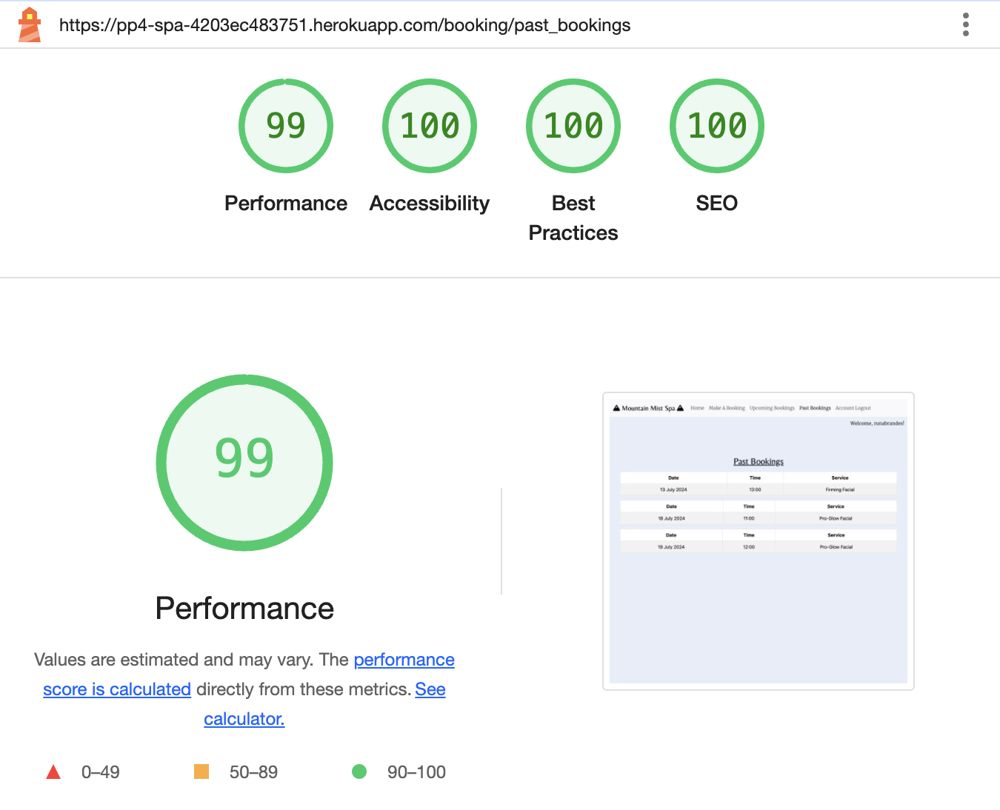

<h1 align=center>TESTING</h1>

#

## AUTOMATED TESTING

I have attempted automated testing but have only written very few automated tests in the end. The relevant file can be found in `booking > test_forms.py `. 

- The test that caused failed results to appear was:

- The terminal was showing following message:

I have decided to remove the test that caused the issues and commit the test_forms.py file without it.

#

## MANUAL TESTING

### USER STORY: Deployed website

Description:
- The user can view the deployed site

Steps:
1. Go to [the deployed site](https://pp4-spa-4203ec483751.herokuapp.com/)
2. View the site

Expected:
- Site loads without errors

Actual:
- As expected

### USER STORY: Navbar

Description:
- A Navbar is displayed to users across all pages

Steps:
1. View all pages
2. Check Navbar is on display
3. Check all Navbar links work

Expected:
- Navbar is always on display
- Mountain Mist Spa logo takes the user to the home page when clicked
- Make A Booking takes the user to the booking form (when logged in)
- Upcoming Bookings takes the user to the upcoming bookings overview (when logged in)
- Past Bookings takes the user to the past bookings overview (when logged in)
- Create Account takes the user to the sign up page (when logged out)
- Account Login takes the user to the sign up page (when logged out)
- Account Logout takes the user to the sign out page (when logged in)

Actual:
- As expected

### USER STORY: Footer

Description:
- A footer is on display to the user across all pages

Steps:
1. View all pages
2. Check footer is on display

Expected:
- Footer is always on display
- The links all work:
    - Facebook takes the user to Facebook (opens in a new window)
    - Instagram takes the user to Instagram (opens in a new window)

Actual:
- As expected

### USER STORY: Services offered shown on home page 

Description:
- The user can view a list of all the service packages offered by the salon

Steps:
1. Go to the home page
2. Scroll to the Services section
3. Click on one of the service buttons

Expected:
- An overview of offered services is shown
- Clicking on a service button will display a modal with more information including:
    - Service name
    - Description
    - Price
    - Link to Book An Appointment

Actual:
- As expected

### USER STORY: Contact details and map

Description:
- The user can view contact details of the salon as well as a map showing the location of the spa

Steps:
1. Go to the home page
2. Scroll to the Contact section
3. View address, phone number and map

Expected:
- An overview of the address and phone number of the salon
- A map of the location of the salon (which opens Google Maps when clicked)

Actual:
- As expected

### USER STORY: Make a booking

Description:
- A user can fill in a form to make an appointment

Steps:
1. Click 'Make A Booking' in the navbar menu (when logged in)
2. Fill in sections of booking form
    - Date
    - Time
    - Service
    - Comments (optional)

Expected:
- A booking is made (this is confirmed by an on-screen message)
- Booked appointment can then be view in Upcoming Bookings section

Actual:
- As expected

### USER STORY: View upcoming bookings

Description:
- A user can view their own upcoming bookings

Steps:
1. Click 'Upcoming Bookings' in the navbar menu (when logged in)
2. View all upcoming bookings

Expected:
- All upcoming bookings are displayed including:
    - Date
    - Time
    - Service
    - Confirmation status
    - Options to edit / delete bookings

Actual:
- As expected

### USER STORY: View past bookings

Description:
- A user can view their own past bookings

Steps:
1. Click 'Past Bookings' in the navbar menu (when logged in)
2. View all past bookings

Expected:
- All past bookings are displayed including:
    - Date
    - Time
    - Service

Actual:
- As expected

### USER STORY: 404 page

Description:
- A user will see a custom 404 page when they try to access a page that is not part of the website

Steps:
1. A user should add some random letters to the end of the URL

Expected:
- Custom 404 page is displayed

Actual:
- As expected

#

## ACCESSIBILITY

[Wave Accessibility](https://wave.webaim.org/) tool was used for final testing of the deployed website to check for any accessibility errors.

The report can be viewed [here](https://wave.webaim.org/report#/https://pp4-spa-4203ec483751.herokuapp.com).

No errors are present, but 8 alerts were raised which are all informing the report viewer of 'Redundant Links'.  
This is due to the Service modals on the home page and the 'Book An Appointment' link in them, which is automatically generated for each modal created and therefore duplication of the links is unavoidbale. 

For the User Experience I have decided to accept these alerts and did not change the modal layout. 

#

## VALIDATOR TESTING

#### HTML

All self-written html files were tested using [W3C HTML Validator](https://validator.w3.org/).

Errors found were:
- base.html:
    - Trailing '/' in favicon tag. This has been removed

- index.html:
    - removed 'type=button' from `<a>` element in the service modals as this was returning an error.

- booking_overview.html:
    - added missing `<tr>` tags to table to wrap around the datble data (`<td>`)

- past_bookings.html:
    - added missing `<tr>` tags to table to wrap around the datble data (`<td>`)

After all the errors had been fixed the HTML passed the validation check. 

#

#### CSS

The CSS was validated using the [W3C CSS Validator](https://jigsaw.w3.org/css-validator/).

No errors were found. 

#

#### Python Linter

All self-written Python files were tested for the correct PEP8 using the [CI Python Linter](https://pep8ci.herokuapp.com/).

Errors found:
- Trailing whitespace error
- Missing new line at end of the file
- Not enough blank lines between functions

All the above have been corrected. 

- The most returned error was E501 - 'line too long error'.   I have tried to format the lines that were longer than 80 characters but then received error E139 - 'continuation line unaligned' instead. 

After researching ways on how to properly format Python code I was able to resolve this issue as well and cleared all Python files of errors. 

#

## LIGHTHOUSE

Lighthouse reports for all pages returned overall positive feedback. 

Please see below:

- Home Page

- Booking Form

- Upcoming Bookings

- Past Bookings

#

## RESPONSIVENESS

Responsiveness has been testing across a few different screen sizes.

- Laptop
- Tablet
- Mobile phone

The responsiveness of the elements was good and no issues were noted when testing the website on laptops and tablets. 

The only issue identified is that the past and upcoming bookings tables won't shrink enough to fit a mobile screen entirely. 

The table is functional and can be viewed fully but in order to do this the user is required to scroll over to the right, so they can see the edit and delete buttons(upcoming bookings table only). This is something I plan to investigate further and resolve as an improvement in the future.

#

## BROWSER COMPATIBILITY

The following browsers were used to test the site:
- Google Chrome
- Safari